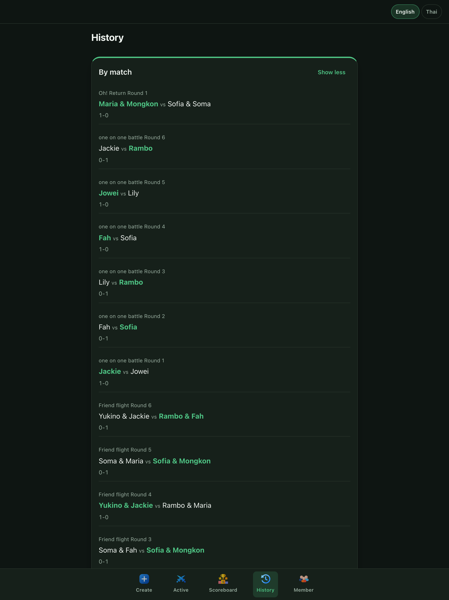
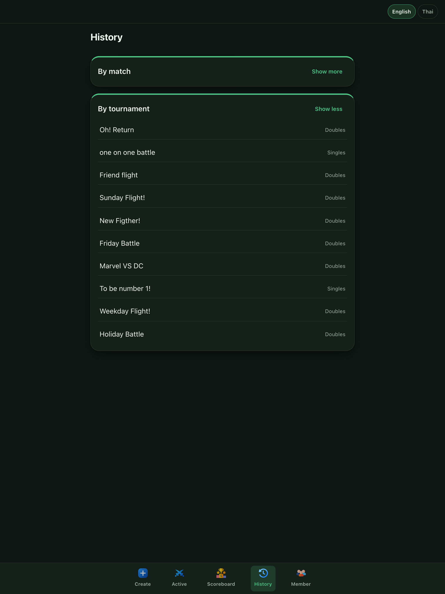

# Racket Score

A club-night app for organizing pickup **badminton or tennis** tournaments
with _balanced random matchmaking_, built around a persistent player pool
shared across tournaments. Pick a sport on the Home screen, switch anytime
from the header — everything else (matchmaking, scoring, both scoreboards)
works identically per sport.

## Screenshots

|                        Active                         |                        Create Tournament                         |
| :---------------------------------------------------: | :--------------------------------------------------------------: |
|  |  |

|                        Overall Scoreboard                         |                        Member                         |
| :---------------------------------------------------------------: | :---------------------------------------------------: |
|  |  |

|                       History (by match)                        |                       History (by tournament)                        |
| :-------------------------------------------------------------: | :------------------------------------------------------------------: |
|  |  |

## Features

- **Badminton or Tennis**, chosen on a Home screen at app entry and
  switchable anytime from a header control; the choice persists across
  browser restarts. Every tab (Create/Active/Scoreboard/History/Member)
  scopes to whichever sport is currently active. Tennis reuses the same
  configurable scoring engine as badminton (see [Design
  decisions](#design-decisions--intentional-limitations)) — the two sports
  never share match history or stats for the same person.
- Central, persistent player pool with generated placeholder avatars
  (initials + name-derived color)
- Self-selected skill level until 3 matches are played, then an
  automatically computed win-rate-derived effective level — tracked
  **independently per sport**, so a player's Badminton and Tennis levels
  never affect each other. A member with no level yet in the active sport
  can't be selected as a tournament participant until one is set on the
  Member tab.
- Balanced random matchmaking (not round-robin) — see [Matchmaking
  algorithm](#matchmaking-algorithm) below
- Singles **or** doubles per tournament, with configurable games-per-match
  and points-per-game
- Deuce cap auto-computed from the BWF 21→30 ratio:
  `round(pointsPerGame * 30 / 21)`
- Two win-rate-based scoreboards: per-tournament and an overall
  cross-tournament view with period/match-type filters
- 5-tab bottom navigation: Create / Active / Scoreboard / History / Member
- Manual override for a drawn-but-not-yet-started match — swap a player
  before the match starts, with a non-blocking warning if the edit breaks
  doubles' gender-balance rule; edited matches are flagged in History
- Mid-tournament roster changes: a participant can leave (soft-removed,
  reversible, immediately excluded from future draws) and the organizer
  can add a late arrival or bring a left participant back — either way a
  fairness offset keeps the equal-match-count invariant fair without
  crediting them in History/Scoreboard for matches they didn't play
- Cancel a tournament before its first match result is confirmed —
  replaces the End action during that window, permanent, shown as a
  "Cancelled" row in History
- Thai/English language toggle, light/dark theme support
- Shared write-access passphrase — anyone can browse freely, but creating,
  editing, or recording any data requires a passphrase, enforced at the
  database level (not just the UI)

## Design decisions & intentional limitations

These are deliberate design choices, not missing features:

- **Tennis uses the same rally-point scoring engine as badminton**, not
  real tennis rules — no sets, no 40-40/advantage deuce, no tie-break at 6
  games. Organizers configure games-per-match/points-per-game/deuce-cap the
  same way for either sport.
- **No user accounts.** Anyone with the link can browse all data — this is
  meant for private, trusted club use. Writes (creating/editing/recording
  anything) require a single shared passphrase, prompted for once per browser
  session — see [Write-access passphrase](#write-access-passphrase) below.
  This is a lightweight gate against accidental or drive-by edits, not a
  real per-user auth system.
- **Confirmed match results are permanently locked.** There is no edit UI
  and no admin override anywhere in the app. A drawn-but-not-yet-started
  match is different — the organizer can edit its lineup before it starts;
  it's the _result_, once confirmed, that can never be changed.
- **The initial roster is chosen once, at tournament creation, from the
  player pool.** Leave and Add participant (see Features above) are the
  only two ways to change it afterward — both narrow, explicitly gated
  actions, not a general "edit the roster" screen, and both are disabled
  once the tournament has ended or been cancelled.
- **Cancelling a tournament is permanent.** It's only available before the
  tournament's first match result is confirmed, and there's no path back
  to active once cancelled.
- **No fixed round count.** The UI always shows "Round N", never "Round N of
  M" — a tournament runs until the organizer manually ends it.
- **No real-time sync.** Data updates via polling/manual refresh only.
- **No photo upload.** Player avatars are always a generated placeholder.
- **Doubles pairs are never persisted as an entity.** Every tournament
  re-pairs individuals from the pool.

## Matchmaking algorithm

The matchmaking engine (`src/features/matchmaking/`) is pure TypeScript with
no React or Supabase dependency, so it can be unit-tested in isolation. It
picks the next match by applying these criteria in strict priority order
(highest first):

1. **Equal match count** — a hard invariant, not just a preference: the gap
   between the most- and least-played participant can never exceed 1. If the
   lowest-match-count group is smaller than the match needs, every player in
   it is drawn, and only the remaining seats are filled from the next group.
2. Skill balance
3. Gender balance
4. Avoid repeat pairings from earlier matches
5. Random choice among whatever remains tied after 1–4

**Doubles is a special case:** gender balance is promoted to a hard filter
above skill balance — a 2-male/2-female quartet split into two mixed-gender
teams is always preferred over an unbalanced alternative, not just used to
break a tie. Singles is unaffected.

While a match is in progress, its participants are excluded from the next
draw's candidate pool (falling back to reusing one, with a UI warning, only
if too few other players remain).

Random tie-breaking in step 5 never overrides a higher-priority criterion —
it only chooses among players/pairings that are already equivalent on every
criterion above it.

A late-joining or rejoining participant (see Design decisions above) is
folded into the equal-match-count invariant via a computed fairness
offset, rather than being special-cased elsewhere in the algorithm.

## Tech stack

- [Vite](https://vitejs.dev/) 6 + [React](https://react.dev/) 18 +
  TypeScript 5
- [react-router-dom](https://reactrouter.com/) 7 for the 5-tab navigation
- [TanStack Query](https://tanstack.com/query) 5 on top of the
  [Supabase](https://supabase.com/) JS client 2
- [react-i18next](https://react.i18next.com/) for the Thai/English toggle
- [Vitest](https://vitest.dev/) 4 + React Testing Library for tests
- Plain CSS (no Tailwind) with custom properties for light/dark theming
- Deployed on [Vercel](https://vercel.com/) via the GitHub integration

> **Node version note:** dependency majors here are pinned below latest —
> `vite@^6` (not 7+), `jsdom@^26` (not 27+), `react@^18` (not 19) — because
> local development targets Node 20.13.1, which is below what those newer
> majors require. Check this constraint before upgrading any of these
> packages.

## Getting started

**Prerequisites:** Node.js ≥ 20.13.1, npm, and a Supabase project (see
[Database setup](#database-setup)).

```bash
git clone https://github.com/narupong-jm/racket_score.git
cd racket_score
npm install
cp .env.example .env   # then fill in your Supabase values, see below
npm run dev
```

The dev server prints a local URL (default `http://localhost:5173`).

## Environment variables

Copy `.env.example` to `.env` and fill in:

| Variable                     | Description                                                                                                                                    | Where to find it                                                                                                             |
| ---------------------------- | ---------------------------------------------------------------------------------------------------------------------------------------------- | ---------------------------------------------------------------------------------------------------------------------------- |
| `VITE_SUPABASE_URL`          | Your Supabase project's API URL                                                                                                                | Supabase dashboard → Project Settings → API                                                                                  |
| `VITE_SUPABASE_ANON_KEY`     | Public anon/publishable API key                                                                                                                | Supabase dashboard → Project Settings → API                                                                                  |
| `VITE_TEST_WRITE_PASSPHRASE` | Write passphrase — only needed to run the write-exercising integration tests, not to run the app itself (the app prompts for it interactively) | Ask whoever administers the Supabase project's `app_secrets` table — see [Write-access passphrase](#write-access-passphrase) |

Never commit `.env` — it's gitignored. `.env.example` contains placeholders
only. **Never put the actual passphrase value in this README, a commit
message, or any other file tracked by git** — it only belongs in a local
`.env` and in the `app_secrets` hash.

## Database setup

The app uses a Supabase Postgres project with Row Level Security enabled on
every table. Reads use a permissive `anon` policy (no per-user auth by
design — see [Design decisions](#design-decisions--intentional-limitations)).
Writes are handled differently: the `anon` role's direct write grants are
revoked, and every write goes through a passphrase-checked RPC instead — see
[Write-access passphrase](#write-access-passphrase) below.

Computed stats are served by SQL views, so every read is automatically
current rather than relying on batch recomputation:

- `player_stats` — win rate and effective skill level, **scoped per sport**
  (one row per player per sport, so a player's Badminton and Tennis stats
  never mix)
- `tournament_standings` — per-tournament match win rate and win-rate
  tiebreak stats (a tournament belongs to exactly one sport, so no
  additional scoping is needed here)
- `player_match_history` — cross-tournament match history for the Overall
  Scoreboard, tagged with `sport`

This repository does not include a `migrations/` or `supabase/` folder —
schema and views were applied directly to the live Supabase project. To
reproduce the schema, provision a new Supabase project and recreate the
tables/views described in [`docs/SPEC.md`](docs/SPEC.md).

## Write-access passphrase

Reading is always open — no passphrase needed to browse. Every write
(create/update/delete, anywhere in the app) requires a single passphrase
shared by the whole club:

- **Enforced in the database, not just the UI.** Every write goes through a
  Postgres RPC function that checks the passphrase against a hash stored in
  an `app_secrets` table. The `anon` role's direct `INSERT`/`UPDATE`/
  `DELETE`/`TRUNCATE` grants are revoked on every table, so a write is
  impossible except through one of these RPCs — talking to the REST API
  directly can't bypass it.
- **Never stored in an env var or in source.** The app prompts for it in a
  modal the first time a write is attempted in a browser tab, then caches it
  in `sessionStorage` for the rest of that tab's session (cleared when the
  tab closes — not persisted longer than that).
- **Set/changed only via migration.** There's no in-app settings screen;
  changing it means updating the hash in `app_secrets` directly (see
  [`docs/PLAN.md`](docs/PLAN.md) Phase 16, step 1).
- Integration tests that exercise real writes need the actual passphrase via
  a `VITE_TEST_WRITE_PASSPHRASE` env var — see
  [Environment variables](#environment-variables) and [Testing](#testing).

## Scripts

| Script            | Description                                 |
| ----------------- | ------------------------------------------- |
| `npm run dev`     | Start the Vite dev server                   |
| `npm run build`   | Type-check (`tsc -b`) then production build |
| `npm run lint`    | Run ESLint                                  |
| `npm run format`  | Run Prettier (writes changes)               |
| `npm run preview` | Preview the production build locally        |
| `npm run test`    | Run the Vitest test suite                   |

> **Do not use `npx tsc --noEmit`** to type-check. The root `tsconfig.json`
> has `"files": []` with only `references`, so non-build-mode `tsc` checks
> an empty file list and silently exits `0` without checking anything, even
> with real type errors present. Use `npx tsc -b` (build mode) or
> `npm run build` instead.

## Project structure

```text
src/
  features/
    players/        # player pool CRUD + stats
    tournaments/     # tournament creation and lifecycle
    matches/         # match creation, results, validation
    matchmaking/      # pure-TS matchmaking algorithm (no React/Supabase)
    scoreboard/      # per-tournament and overall scoreboard data layer
    passphrase/      # write-access passphrase gate (context, provider, API)
    sport/           # sport-workspace context/provider/hook (Badminton/Tennis)
  pages/             # Home (sport picker) + the 5 tab routes (Create/Active/Scoreboard/History/Member)
  components/        # shared UI components
  lib/               # Supabase client, generated DB types, shared utilities
  i18n/               # en.json / th.json locale files
```

## Testing

```bash
npm run test                              # full suite
npx vitest run src/App.test.tsx           # single file
npx vitest run -t "test name"             # single test case
```

The `matchmaking/` test suite is the most important test asset in the
project — it's the highest-risk, most heavily tested part of the codebase.

Some tests are integration tests that hit a real Supabase project
(`*.integration.test.ts`, e.g. `src/features/players/playersApi.integration.test.ts`)
and require valid `VITE_SUPABASE_URL`/`VITE_SUPABASE_ANON_KEY` env vars to
pass. The subset of those that perform writes (creating a player, a
tournament, a match, etc.) also require `VITE_TEST_WRITE_PASSPHRASE` — see
[Write-access passphrase](#write-access-passphrase).

## Deployment

Deployed on Vercel via the GitHub integration — pushes to `main` trigger a
deploy automatically. `vercel.json` rewrites all routes to `/index.html` for
client-side routing.

> **Watch out:** Vercel checks the pushed commit's author email against the
> connected GitHub account and **silently blocks the deploy** if they don't
> match (the push still succeeds — you have to check the Vercel dashboard to
> notice). Confirm `git config user.email` matches your GitHub account's
> verified email before pushing a commit that needs to deploy.

## Documentation map

| File                                           | Purpose                                                                           |
| ---------------------------------------------- | --------------------------------------------------------------------------------- |
| [`docs/SPEC.md`](docs/SPEC.md)                 | Normative product requirements — source of truth for what to build                |
| [`docs/IMPROVEMENT.md`](docs/IMPROVEMENT.md)   | UX rationale behind the 5-tab navigation rework                                   |
| [`docs/IMPROVEMENT2.md`](docs/IMPROVEMENT2.md) | Post-launch patch: matchmaking corrections, manual draw editing, History collapse |
| [`docs/IMPROVEMENT3.md`](docs/IMPROVEMENT3.md) | Post-launch patch: mid-tournament Leave / Add participant, fairness offset        |
| [`docs/IMPROVEMENT4.md`](docs/IMPROVEMENT4.md) | Multi-sport support (Badminton + Tennis): schema, sport workspace, per-sport level |
| [`docs/PLAN.md`](docs/PLAN.md)                 | Phased implementation plan and stack decisions                                    |
| [`docs/RESEARCH.md`](docs/RESEARCH.md)         | Point-in-time snapshot of environment/account state at planning time              |
| [`CLAUDE.md`](CLAUDE.md)                       | Instructions for AI coding agents working in this repo                            |

## License

[MIT](LICENSE)
